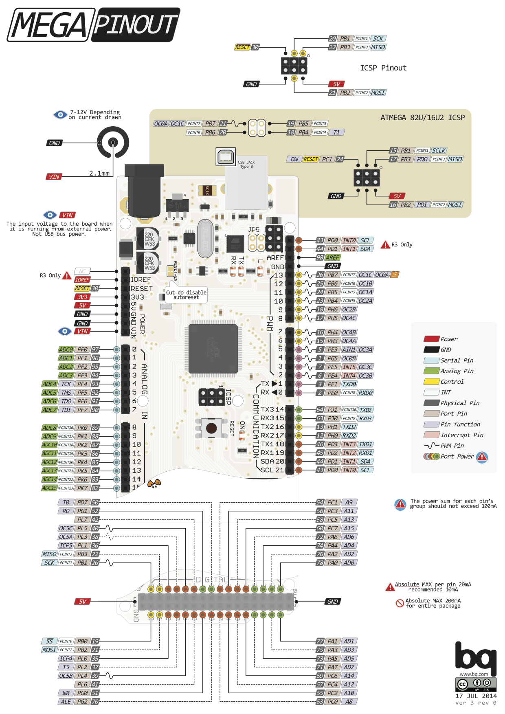
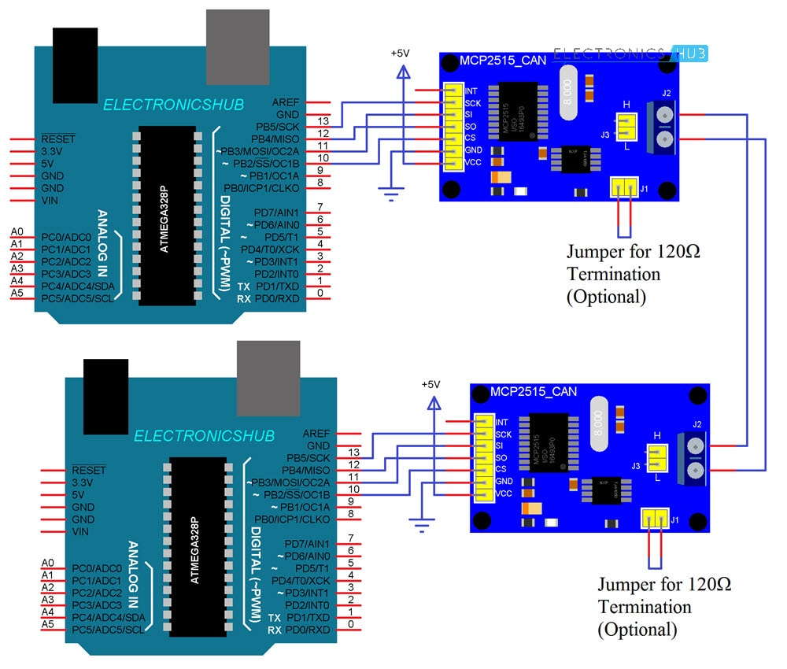

# can_around
Play around with CAN bus using micropython and MCP chips on ESP modules

[](http://docs.micropython.org/en/latest/)




## Setting up USBTinyISP support in Ubuntu
```sh
sudo nano /etc/udev/rules.d/99-USBtiny
```
Then paste
```
SUBSYSTEM=="usb", SYSFS{idVendor}=="1781", SYSFS{idProduct}=="0c9f", GROUP="users", MODE="0666"
```
or
```
SUBSYSTEM=="usb", ATTR{idVendor}=="1781", ATTR{idProduct}=="0c9f", GROUP="adm", MODE="0666"
```
into the new file. Write it out by pressing `Ctrl-O` and `Ctrl-X` to exit.
```sh
sudo usermod -a -G plugdev YOURUSERNAME
sudo service udev restart
sudo udevadm control --reload-rules
```
Insert the USBtinyISP again.

## Useful links
* [HABR VAG](https://habr.com/en/post/442184/)
* [Arduino simple communication](https://www.electronicshub.org/arduino-mcp2515-can-bus-tutorial/)